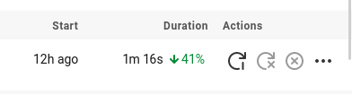

## Résumé

Site web d'Orange County Lettings

## Déploiement de l'application

### Les outils
* CSV Git
* Circle CI
### En bref

**Contexte**: ce diagramme couvre uniquement le déploiement de l'application depuis la branche ``master``. Dans le cas contraire, les étapes 2 à 5 n'ont pas lieu et seuls les tests de l'application sont exécutés par l'outil de CI/CD.

1. Envoi des modifications locales sur [github](https://github.com/evrard1301/Python-OC-Lettings-FR).
2. Construction de l'image docker puis envoi sur [docker hub](https://hub.docker.com/repository/docker/bog13/lettings/general).
3. Exécution du script de deploiement du server (``deploy.sh``) *via* ssh.
4. Récupération de l'image de l'application depuis docker hub.
5. Fin du déploiement, la nouvelle version du site est disponible en ligne.

### Lancer le déploiement
Le déploiement se déclenche dans trois cas:

1. suite à un ``git push`` depuis la branche ``master`` ou,
2. en lançant un déploiement manuel depuis l'interface de CircleCI ou
3. en passant par l'API de circleci: [https://circleci.com/docs/api/v2.](https://circleci.com/docs/api/v2)

## Développement local

### Prérequis

- Compte GitHub avec accès en lecture à ce repository
- Git CLI
- SQLite3 CLI
- Interpréteur Python, version 3.6 ou supérieure

Dans le reste de la documentation sur le développement local, il est supposé que la commande `python` de votre OS shell exécute l'interpréteur Python ci-dessus (à moins qu'un environnement virtuel ne soit activé).

### macOS / Linux

#### Cloner le repository

- `cd /path/to/put/project/in`
- `git clone https://github.com/OpenClassrooms-Student-Center/Python-OC-Lettings-FR.git`

#### Créer l'environnement virtuel

- `cd /path/to/Python-OC-Lettings-FR`
- `python -m venv venv`
- `apt-get install python3-venv` (Si l'étape précédente comporte des erreurs avec un paquet non trouvé sur Ubuntu)
- Activer l'environnement `source venv/bin/activate`
- Confirmer que la commande `python` exécute l'interpréteur Python dans l'environnement virtuel
`which python`
- Confirmer que la version de l'interpréteur Python est la version 3.6 ou supérieure `python --version`
- Confirmer que la commande `pip` exécute l'exécutable pip dans l'environnement virtuel, `which pip`
- Pour désactiver l'environnement, `deactivate`

#### Exécuter le site

- `cd /path/to/Python-OC-Lettings-FR`
- `source venv/bin/activate`
- `pip install --requirement requirements.txt`
- `python manage.py runserver`
- Aller sur `http://localhost:8000` dans un navigateur.
- Confirmer que le site fonctionne et qu'il est possible de naviguer (vous devriez voir plusieurs profils et locations).

#### Linting

- `cd /path/to/Python-OC-Lettings-FR`
- `source venv/bin/activate`
- `flake8`

#### Tests unitaires

- `cd /path/to/Python-OC-Lettings-FR`
- `source venv/bin/activate`
- `pytest`

#### Base de données

- `cd /path/to/Python-OC-Lettings-FR`
- Ouvrir une session shell `sqlite3`
- Se connecter à la base de données `.open oc-lettings-site.sqlite3`
- Afficher les tables dans la base de données `.tables`
- Afficher les colonnes dans le tableau des profils, `pragma table_info(Python-OC-Lettings-FR_profile);`
- Lancer une requête sur la table des profils, `select user_id, favorite_city from
  Python-OC-Lettings-FR_profile where favorite_city like 'B%';`
- `.quit` pour quitter

#### Panel d'administration

- Aller sur `http://localhost:8000/admin`
- Connectez-vous avec l'utilisateur `admin`, mot de passe `Abc1234!`

### Windows

Utilisation de PowerShell, comme ci-dessus sauf :

- Pour activer l'environnement virtuel, `.\venv\Scripts\Activate.ps1` 
- Remplacer `which <my-command>` par `(Get-Command <my-command>).Path`
